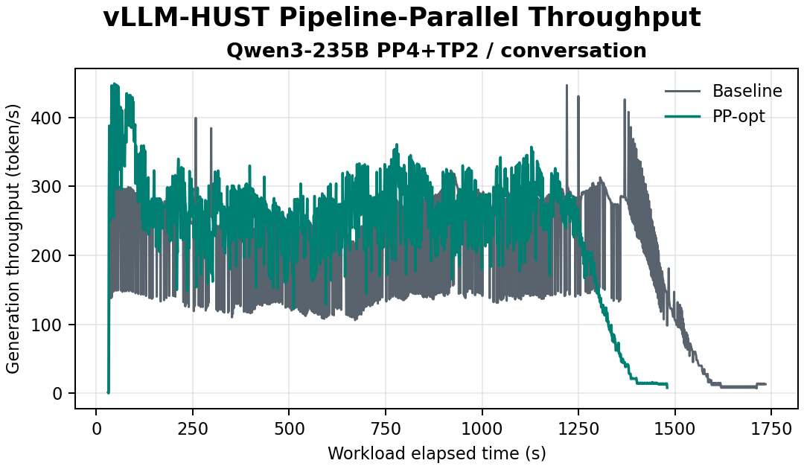

# PP Optimization Results

## Validated Qwen3-32B comparison

The validated experiment used Qwen3-32B, PP4 + TP2, eight Ascend 910C NPUs,
the 1,000-request conversation trace, four static microbatches, calibrated
cost placement, full transformer execution, and no PP send overlap. Both modes
completed all requests and generated the same 349,357 output tokens.

| Mode | Duration | Request throughput | Output throughput |
| --- | ---: | ---: | ---: |
| Baseline | 1,446.91 s | 0.6911 req/s | 241.45 tok/s |
| PP-opt | 1,187.73 s | 0.8419 req/s | 294.14 tok/s |
| Speedup | **1.218x** | **+21.82%** | **+21.82%** |

## Validated Qwen3-235B-A22B comparison

The 235B experiment used the same 1,000-request conversation trace and client
policy with PP4 + TP2 on eight Ascend 910C NPUs. All 94 MoE transformer layers
executed on both paths. Dummy loading initialized parameters and shared
corresponding repeated-layer storage, while the real embedding came from the
first checkpoint shard. Both modes completed every request and generated the
same 349,357 output tokens.

| Mode | Duration | Request throughput | Output throughput |
| --- | ---: | ---: | ---: |
| Baseline | 1,735.38 s | 0.5762 req/s | 201.31 tok/s |
| PP-opt | 1,479.88 s | 0.6757 req/s | 236.07 tok/s |
| Speedup | **1.173x** | **+17.27%** | **+17.27%** |

The full run followed a real 200-request regression gate that measured
158.82 tok/s for baseline and 190.76 tok/s for PP-opt, a 1.201x speedup. Both
gate runs also completed without failures and generated an identical 71,379
output tokens.

| Latency metric | Baseline | PP-opt | Change |
| --- | ---: | ---: | ---: |
| Mean | 200.42 s | 174.95 s | **-12.71%** |
| P50 | 213.10 s | 186.75 s | **-12.36%** |
| P99 | 548.88 s | 465.06 s | **-15.27%** |
| Mean client admission wait | 1.361 s | 1.182 s | **-13.20%** |

The compact machine-readable record is stored at
`results/end_to_end/qwen3_235b_conversation/result.json`. The Qwen3-32B and
Qwen3-235B-A22B conversation pairs are now validated. The two BurstGPT pairs
still require full reruns with the same static configuration.

The figure uses all 3,152 one-second server samples clipped to each client's
first-send through final-completion interval. The underlying series is stored
next to the figure as `throughput.csv`.

## Pipeline compactness

A matched five-second CANN profile used the same static configuration under
approximately 90 active requests and 90-95% KV-cache occupancy. Metrics use
TP rank zero for each PP stage.

| Metric | Baseline | PP-opt | Change |
| --- | ---: | ---: | ---: |
| Average PP stages computing | 0.887 | 1.710 | **+92.81%** |
| Mean per-stage compute duty | 22.18% | 42.76% | **+92.81%** |
| Time with at least 2 stages computing | 0.00% | 54.70% | **+54.70 pp** |
| Time with all 4 stages computing | 0.00% | 6.85% | **+6.85 pp** |
| Median wave start skew | 433.5 ms | 179.5 ms | **-58.60%** |
| P95 wave span | 764.1 ms | 292.4 ms | **-61.73%** |
| Active-kernel Cube utilization | 76.67% | 55.12% | -28.11% |
| Wall-clock Cube utilization proxy | 13.00% | 15.65% | **+20.40%** |
| Time with no stage computing | 11.29% | 14.85% | +3.57 pp |

The baseline produced 19 large forward waves in the capture window, with a
median 90 requests and 1.339 million context tokens per wave. PP-opt produced
76 waves, exactly four times as many, with medians of 21.5 requests and 341
thousand context tokens. Multiple stages computed concurrently for 54.7% of
the optimized window versus 0% of the baseline window.

The concurrency gain is larger than the end-to-end speedup because smaller
microbatches reduced active-kernel Cube utilization by 28.1%. Wall-clock Cube
utilization still rose by 20.4%, closely matching the measured 21.8% output
throughput improvement.

The machine-readable profile summary and figure are under
`results/pipeline_profile/analysis/`. The Cube metric is an MFU proxy derived
from CANN `PipeUtilization`; it is not a formal FLOP-based MFU value.

## Calibration quality

Each checked-in deployment was profiled over 48 workload points. The installed
models are hash-bound to their model and benchmark configurations.

| Model | Samples per rank/cost | R2 range | Configuration |
| --- | ---: | ---: | --- |
| Qwen3-32B | 3,852-3,877 | 0.925-0.934 | `configs/qwen3_32b_pp4tp2_8x910c/` |
| Qwen3-235B-A22B | 3,879-3,956 | 0.626-0.660 | `configs/qwen3_235b_pp4tp2_8x910c/` |

The 235B fit has materially lower R2, but its required short end-to-end gate
passed at 1.201x before the validated full run was launched.
